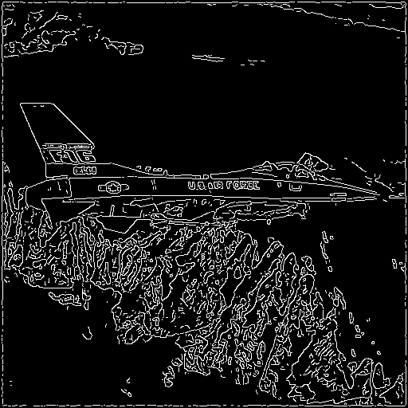

# Canny-Cuda (Canny Edge Detector with CUDA Programming)

The Canny Edge Detector is a popular, multi-stage computer vision algorithm developed in 1986 to extract useful structural information from images while minimizing noise. It identifies object boundaries by detecting sharp changes in brightness through a process involving Gaussian smoothing, gradient calculation, non-maximum suppression, and hysteresis thresholding.

## Summary of the approach

### CUDA Parallelization Strategy

#### Thread Organization
The main idea is to assign one GPU thread to each pixel in the image. This creates a natural way to divide the work since each pixel can be processed at the same time. The code uses 16×16 thread blocks, which means 256 threads work together in each block. The number of blocks is calculated based on the image size to make sure every pixel gets processed (in this case, a 32 by 32 grid).

#### Memory Management
The implementation uses different types of GPU memory efficiently. Most image data is stored in global memory, which all threads can access. For the min/max finding operation, shared memory is used to speed things up by keeping data closer to the processing units.

### Algorithm Implementation 

#### Gaussian Filtering
This step removes noise from the image by blurring it slightly. Each thread calculates one output pixel by applying a gaussian filter to its area of the input image. The filter size changes automatically based on the sigma parameter - bigger sigma means more blur. Boundary pixels are handled carefully to avoid accessing memory outside the image.

#### Min/Max Finding
To normalize the image later, we need to find the brightest and darkest pixels. This is tricky to do in parallel since we need to compare all pixels. The solution uses a two-step process: first, each block of threads finds its local minimum and maximum using shared memory. Then, the CPU combines all these local results to find the global min and max. This algorithm corresponds to the parallel reduction (sequencial addressing).

#### Normalization
Once we know the min and max values, each thread can independently scale its pixel to the standard 0-255 range. This is perfectly parallel since no communication between threads is needed.

#### Gradient Computation
This step finds edges by looking for rapid changes in brightness. It uses two Sobel filters - one for horizontal changes and one for vertical changes. The same convolution function is reused for both directions by just changing the filter coefficients. After both gradients are calculated, another kernel combines them to get the final gradient strength.

#### Non-Maximum Suppression
This step makes thick edges thinner by keeping only the strongest pixels along each edge direction. Each thread looks at its pixel's gradient direction and compares its strength with neighboring pixels in that direction. Only pixels that are stronger than their neighbors survive this step.

#### Hysteresis Thresholding
The final step uses two thresholds to decide which pixels are really edges. Strong pixels (above the high threshold) are automatically kept as edges. Weak pixels (above the low threshold) are only kept if they connect to strong edges. The first part is easy to parallelize, but the second part requires multiple passes through the image until no more changes happen.

### Key Optimizations

#### Computational Efficiency
The min/max operation uses a smart reduction technique that works like a tournament - pairs of values are compared and winners advance to the next round. Shared memory keeps intermediate results on the GPU chip, avoiding slower global memory access.

## Setup instructions

Make sure you're in the project root:
```bash
cd cuda-canny
```

Compile using make:
```bash
make
```

## Usage details

Run the executable from the ~/cuda-canny directory:

```bash
./canny [-h] [-d device] [-i inputfile] [-o outputfile] [-r referenceFile] [-s sigma] [-n tmin] [-x tmax]

```

### Parameters:
| Option | Description |
|--------|-------------|
| `-h`   | Display help message |
| `-d`   | CUDA device ID (default: 0) |
| `-i`   | Input PGM image file (default: `images/lake.pgm`) |
| `-o`   | Output image file from device (default: `out.pgm`) |
| `-r`   | Reference output file from host (default: `reference.pgm`) |
| `-s`   | Sigma value for Gaussian blur (default: `1.0`) |
| `-n`   | Minimum threshold (`tmin`, default: `45`) |
| `-x`   | Maximum threshold (`tmax`, default: `50`) |

### Example:
```bash
./canny -i images/jetplane.pgm
```

This command runs the Canny edge detector using the default values for:

- Sigma

- Minimum threshold

- Maximum threshold

Input image:


After execution, the program generates two `.pgm` output files:

- `reference.pgm`: Generated using the **CPU (host)** implementation

- `out.pgm`: Generated using the GPU **(CUDA device)** implementation

The outputs are expected to be nearly identical (see [Output Quality](###output-quality)) . Significant differences would indicate an issue in the GPU implementation.

Example GPU output:



## Performance Analysis 

The performance of the CUDA-accelerated Canny Edge Detector was evaluated over **100 executions** using default parameters. Execution times of the CPU (host) and GPU (device) implementations were compared.

### Execution Time

| Metric                   | Value         |
|--------------------------|---------------|
| Avg. Host Time           | 32.92 ms      |
| Avg. Device Time         | 1.34 ms       |

### Speedup

The speedup achieved by the GPU implementation is calculated as:

```
Speedup = CPU_Time / GPU_Time
        = 32.92 / 1.34 ≈ 24.6×
```

This demonstrates a significant performance improvement when using CUDA acceleration.

### Output Quality

In the worst-case scenario (using `walkbridge.pgm` with default parameters), the GPU output differs from the CPU reference by only:

- **2 pixels out of 262,144 total pixels**

- **≈ 0.0008% error rate**

This extremely small discrepancy confirms that the GPU implementation maintains **high numerical accuracy** while achieving substantial performance gains.
